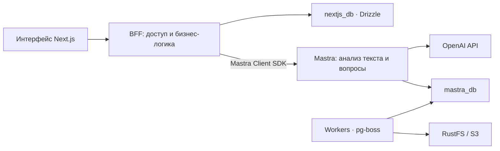

# AI-Sana — Мэтч задач

**От знаний — к первой работе.** Хакатонный проект команды **BGK-TEAM**.

<p align="center">
  
</p>

## Что делает проект

AI-Sana помогает бизнесу превратить нечёткую идею в понятную задачу, а студенческим
командам — найти проект для практики или подработки. AI уточняет требования,
бизнес подтверждает сведения, команда предлагает решение. Дальше участники
согласуют работу и принимают результат по измеримым критериям.

## Что реализовано

- Рабочее пространство с вводным сценарием, карточками задач, AI-чатом и переключением темы.
- Пошаговое уточнение задачи («прожарка»): вопросы, редактирование и подтверждение полей.
- Рейтинг готовности от 0 до 100 и история его изменений. Баллы рассчитываются в коде.
- Каталог с фильтрами и рекомендации командам по ролям, навыкам и тематике; виды «колода» и «сетка».
- Отклики команд, принятие, отклонение и откладывание решения бизнесом.
- Стартовый пакет после выбора команды, сдача этапов, возврат на доработку и подтверждение результата.
- Демо-переключение бизнеса и команды, серверные проверки роли и владельца данных.

## Как работает решение

1. **Бизнес описывает проблему.** AI задаёт уточняющие вопросы и предлагает заполнение карточки.
2. **Бизнес проверяет поля.** Подтверждённые сведения участвуют в пересчёте рейтинга и видны исполнителям.
3. **Задача публикуется.** Команда находит её в каталоге или рекомендациях и отправляет план решения.
4. **Бизнес выбирает команду.** Создаётся мэтч со стартовым пакетом и этапами по критериям успеха.
5. **Команда сдаёт результат.** Бизнес принимает этап или возвращает его с замечаниями.

## Технологии

| Область | Используется |
| --- | --- |
| Язык и инструменты | TypeScript, Bun 1.4.2, Node.js ≥24, Turborepo |
| Интерфейс и BFF | Next.js 16.3.6, React 19.2.8, Tailwind CSS 4, shadcn/ui, Radix |
| AI | Mastra, AI SDK 6, `@mastra/client-js`, OpenAI API |
| Данные | PostgreSQL с pgvector, Drizzle ORM, Mastra PostgresStore, Zod |
| Фоновые задачи и файлы | pg-boss 10, RustFS / S3, AWS S3 Client |
| Локальная инфраструктура | Docker Compose |

В коде AI-модель по умолчанию — `openai/gpt-5.4-nano`.
Модель можно переопределить через `LLM_MODEL`, `CLASSIFIER_MODEL` и `GRILL_MODEL`.
Доступ к выбранной модели зависит от учётной записи провайдера.

## Архитектура



- `apps/presentation-layer` — UI, API, состояние задач, рейтинг, отклики и этапы.
- `apps/ai-logic-layer` — AI-агенты и workflows `analyze-text` / `phrase-question`.
- `apps/workers` — отдельный процесс очередей; сейчас содержит демонстрационный обработчик.

UI обращается к AI через BFF и Mastra. Рейтинг, подбор и изменение бизнес-состояния
выполняются в приложении. Бизнес-данные и данные Mastra разделены на две БД;
запросов с объединением таблиц между ними нет.

## Установка и запуск

Нужны **Git**, **Node.js ≥24**, **Bun 1.4.2** и запущенный **Docker с Compose v2**.
На Windows используйте WSL2 с Docker integration.

```bash
git clone https://github.com/BAITC-Hacks/hack-810705c9-bgk-team.git
cd hack-810705c9-bgk-team
cp .env.example .env
```

Для AI укажите в корневом `.env`:

```dotenv
OPENAI_API_KEY=<ваш ключ OpenAI>
MASTRA_CHAT_AGENT_ID=grillAgent
```

Затем запустите:

```bash
./start.sh
```

Скрипт установит зависимости по lockfile, поднимет PostgreSQL и RustFS,
применит миграции, добавит демо-данные и запустит UI, Mastra и workers.
Существующие записи при заполнении демо-данных сохраняются.

| Сервис | Адрес по умолчанию |
| --- | --- |
| Приложение | http://localhost:3000 |
| Mastra Studio / API | http://localhost:4111 |
| RustFS Console | http://localhost:9001 |

Остановка — `Ctrl+C`; данные БД сохраняются в Docker volumes.
Если запуск не удался, выполните `./doctor.sh`.
Подробности и настройка портов — в [QUICKSTART.md](QUICKSTART.md).

## Как проверить решение

### Быстрое знакомство на демо-данных

1. Откройте [каталог](http://localhost:3000/catalog).
2. В демо-переключателе выберите роль **«Команда»** и команду **BotForge**.
3. Откройте рекомендации: проверьте карточки, объяснение совпадения и переключение колоды/сетки.
4. В каталоге найдите **«Бот статусов доставки»** и нажмите **«Откликнуться»** — откроется карточка с формой отклика.

### Полный пользовательский сценарий

1. Откройте [задачи](http://localhost:3000/task-match), выберите роль **«Бизнес»** и **«ЛогистикаПро»**.
2. Создайте задачу, например:

   > Диспетчеры вручную планируют 120 доставок в день в Excel и тратят на это
   > четыре часа. Нужен сервис составления маршрутов с учётом окон доставки.
   > Успех — сократить время планирования до 30 минут на согласованном наборе заказов.

3. Ответьте на вопросы, проверьте и подтвердите поля и критерии успеха.
   Посмотрите рейтинг и историю, затем опубликуйте задачу.
4. Переключитесь на **BotForge**, найдите задачу в каталоге и отправьте отклик:
   идея, план, срок, роли команды и способ проверки каждого критерия.
5. Вернитесь к **«ЛогистикаПро»**, откройте отклик и выберите команду.
6. От команды сдайте этап со ссылкой на результат и комментарием.
   От бизнеса подтвердите этап либо верните его на доработку.

**Ожидаемый результат:** задача проходит путь от черновика до мэтча и принятого этапа;
рейтинг обновляется при изменении подтверждённых полей, данные сохраняются в PostgreSQL.
Это инструкция для воспроизведения, а не отчёт о пройденном end-to-end тесте.

## Данные и интеграции

- **Демо-данные:** задачи и профили команд из [seed-файла](apps/presentation-layer/src/shared/db/seed/task-match-seed.ts), включая BotForge, DataBrew и PixelUX.
- **Пользовательские данные:** описания задач, подтверждённые поля, отклики, критерии и отчёты по этапам.
- **OpenAI API:** обработка текста и генерация вопросов через Mastra; нужен ключ и доступ к модели.
- **PostgreSQL и RustFS:** локальные сервисы Docker Compose. Наличие RustFS не означает, что документы UI уже загружаются на сервер.
- **Голосовой ввод:** использует возможности распознавания речи браузера, если они доступны.

## Известные ограничения

- Это демо без полноценной аутентификации: роль хранится в cookie. Для публичного использования нужна настоящая авторизация.
- При недоступности AI предусмотрен резервный сценарий уточнения; свободный AI-чат требует настроенного провайдера.
- Документы рабочего пространства хранятся в памяти браузера; серверное хранение вложений этого интерфейса не подключено.
- Workers содержат пример очереди; полноценный фоновый бизнес-сценарий не заявляется.
- Голосовой ввод зависит от браузера и разрешения на микрофон.
- Итоговый сквозной сценарий с live AI и переносом заполненной БД не подтверждён полной приёмкой; подробности — в [заметке интеграции](docs/adr/2026-09-23-pr15-task-match-integration.md).

## Развёрнутая версия

Подтверждённая ссылка на публичный стенд в репозитории не указана.
Для демонстрации используйте локальный запуск по инструкции выше.

## Документация

[Быстрый старт](QUICKSTART.md) · [Архитектура](docs/ARCHITECTURE.md) ·
[Требования MVP](docs/TASK_MATCH_MVP_SPEC.md) · [Архитектурные решения](docs/adr/README.md)
